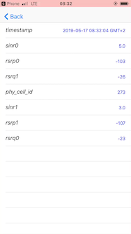
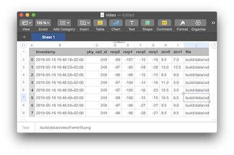
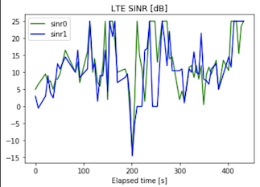
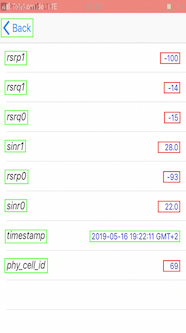
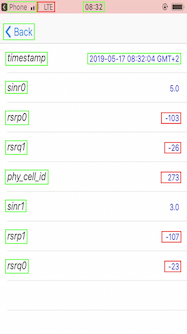
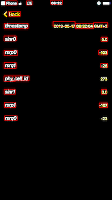
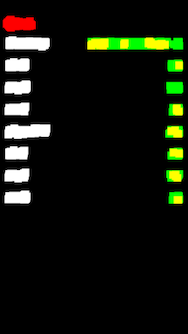
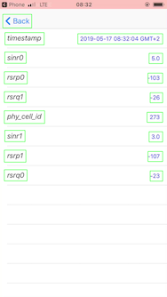

# iOS Field Test Mode OCR Parser using OpenCV and Tesseract

WORK IN PROGRESS

## Description
This project is an implementation of text detection and text recognition using [OpenCV](https://opencv.org) and [Google Tesseract](https://opensource.google.com/projects/tesseract) with corresponding Python wrappers to extract field test mode measurements from iOS obtained by built-in screen recording and post-processing.

This project serves solely learning purpose to practice text detection and optical character recognition (OCR).

There are of course many things that can be improved, feel free to experiment, discuss or pull request.

## Background
Field Test Mode on the iPhones provides infromation about radio channel conditions, such as received power levels or signal-to-noise ratios, as well as information to which base station the phone is currently connected. However, unlike Android, the iOS does not provide any API to access this data.

## Input description
Input for the processing is a video file which as then transformed to the unique image sequence. Since the frame rate is higher than 1 frame per second and the data changes even less frequently we need to extract only frames with new information on them.

A frame sample:



The areas of interests are labels on the left-hand side and values on the right-hand side and how the latter are changing over time. That what we will detect and recognize.

## Outcome
As a result I want to get a CSV file with a time trace of a received signal strength. All values are converted to the corresponding format (Integer, Float, Date and time) and validated, such as a valid range. The figures below show the output generated by the script and a sample plot for SINR values over time.

 


## Dependencies
* Python 3
* [Google Tesseract](https://github.com/tesseract-ocr/tesseract)
* [pytesseract](https://pypi.org/project/pytesseract/)
* [opencv-python](https://pypi.org/project/opencv-python/)
* [numpy](https://pypi.org/project/numpy/) and [pandas](https://pypi.org/project/pandas/) 
* [imutils](https://pypi.org/project/imutils/)
* [dateutil](https://pypi.org/project/python-dateutil/)
* [scikit-image](https://scikit-image.org)

All dependencies are in the `requirements.txt` and can be installed using `pip`, also in the virtual environment.

## Usage
Usage example, the resulting table will be saved to `build/data/video.csv` file and video frames to `build/data/video` folder. Where `i` is the path to the video file.
```bash
python3 test.py -i=build/data/video.mp4
# or specifying number of CPU cores to use for multithreading
python3 test.py -i=build/data/video.mp4 --n-proc=10
```

You can run only frames extraction:
```
python3 test.py -i=build/data/video.mp4 --skip-extracting
```

Likewise, if frames already extraced, one can skip that step:
```
python3 test.py -i=build/data/video.mp4 --skip-parsing
```

## Development
Setup [virtual environment](https://packaging.python.org/guides/installing-using-pip-and-virtual-environments/)

In the repository folder run the following commands:
```
virtualenv --no-site-packages venv
source venv/bin/activate
pip3 install -r requirements.txt
```

## Project structure
The main script is located in `cli.py` file. Us `python3 cli.py -h` to explore all possible options.

The script file `consts.py` contains constants, such as types, folder names. 

`recognizer.py` is an implementation of text recognition procedure, along with keys, values detection and correction.

`text_helper.py` contains functions to validate and correct strings.

`cv_helper.py` is a set of methods related to OpenCV, e.g. to extract video frames or pre-process images.

## Constants explanation

```python
CHECK_NONE = 0
CHECK_REPLACE = 1
CHECK_DISTANCE = 2
```
It also contains replace rules as a dictionary `REPLACE_RULES`:
```python
REPLACE_RULES = {
    "1,-1": ["i", "[", "]", "l", "7", "?", "t"],
    "0,-1": ["o"],
    "q,-2": ["g"],
    "0,": ["0o", "o0", "00", "oo"],
    "q,": ["qg","qq","gg","gq"]
}
```
The key is comma seperated, first element is a desired character and the second value is a position on which make replacements. The value is a list of values that might be seen instead. In other words character `i`, `[`, `]`, `l`, etc. on position `-1` will be replaced by `1`.

Another helpful dictionary is `EXPECTED_KEYS` is a list which we describe expected data, for example:
```python
    "phy_cell_id": {
        "corr": CHECK_DISTANCE,
        "map": int
    },
    "rsrp0": {
        "corr": CHECK_REPLACE,
        "map": int
    },
```
In this case we describe that value `phy_cell_id` should be an integer and correction function will be Levenshtein distance calculation. The `rsrp0` value will be corrected by replacing symbols using `REPLACE_RULES` dictionary.

## Get video frames
TODO: Extract frames description

## Text recognition
Google provides a very powerful and helpful library: Tesseract. Using pytesseract the text on image can be recognized with a single line of code:
```python
text = pytesseract.image_to_string(image)
```

So, we can just feed in the whole image to the Tesseract and get the text. Well, yes and no.

Here is the result:
TODO: Image with recognised text here

## Text detection
In order to improve accuracy of Tesseract we need to extract single words and process them.

There are some special libraries and neural networks for the text detection problem like [EAST](https://github.com/argman/EAST) or [Core ML Vision](https://developer.apple.com/documentation/vision).

Here some CoreML result (without pre-processing):

 

EAST frozen model with Tensorflow also gives a result which can be used with some post-processing:

 


However, I have later realised that using this libraries for this case is too overwhelming and processing takes some time. While doing experiments with image pre-processing, I have noticed that text can be transofrmed into filled rectangles. On the other hand it makes easier to distinguish it from the background and applying OpenCV we can detect now contours of those areas.

 
 

Pre-processing of the original image affects the result a lot, but preparing image for contour detection is much easier task than for text detection:
```python
new_image = image.copy()
_, new_image = cv2.threshold(new_image, 0, 255, cv2.THRESH_BINARY_INV)
kernel = np.ones((15, 15),np.uint8)
new_image = cv2.dilate(new_image, kernel, iterations = 2)
```

## Multiprocessing
The video which contains 68 unique frames with 1 thread takes 236.84 seconds to process. Using some straight-forward multiprocessing by separating frames between CPU, result with 10 parallel threads gives 57.95 seconds for the same processing.

## Authorship and license
Igor Kim

The repository is distributed under [MIT license](LICENSE.md).
